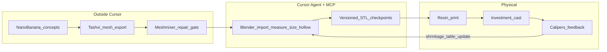

# Jewelry Casting Pipeline — Cursor Kickstart Plan

## Project location

**New standalone folder** — completely separate from `livechatadmin` and your other work repos.

| | |
|---|---|
| **Path** | `/Users/albertocole/WebstormProjects/jewelry-casting-pipeline` |
| **Open in Cursor** | File → Open Folder → select `jewelry-casting-pipeline` |
| **Why separate** | Own `.cursor/mcp.json`, rules, and mesh assets; no coupling to messaging code |

Phase 1 **completed** — repo scaffold, docs, rules, MCP config, and fixture STL are in place.

---

## Goal

Stand up that **standalone repo** at `~/WebstormProjects/jewelry-casting-pipeline` that wires together:

- **Nano Banana** (Gemini) — 2D concept PNGs (outside Cursor)
- **Tashvi** — jewelry mesh export STL/OBJ/GLB (outside Cursor; Pro required for mesh)
- **Blender 5.1.2 + [official Blender Lab MCP](https://www.blender.org/lab/mcp-server/)** ([bpype/blender_mcp](https://github.com/bpype/blender_mcp)) — supervised precision prep via **Cursor Agent mode**
- **Physical** — castable resin print → investment casting



---

## Phase 0 — Prerequisites (before writing any project files)

| Requirement | Action |
|-------------|--------|
| macOS | Already confirmed (darwin) |
| **Blender** | **5.1.2** installed — official MCP requires **5.1+**; pinned in `.blender-version` |
| **uv** | `brew install uv` — required to launch official MCP server via `uvx` |
| **Tashvi Pro** | Required for STL/OBJ/GLB; free tier is PNG-only — upgrade before mesh workflow |
| **Meshmixer** | Free Autodesk tool — **mandatory repair gate** before Blender (adversarial finding) |
| **Castable resin printer** | Note brand/resolution in `docs/equipment.md` (≤50µm MSLA preferred for fine detail) |
| **Casting access** | Own kiln/caster OR casting house — confirm whether they apply their own shrinkage compensation |

---

## Phase 1 — Create the repo and folder structure

Initialize git repo at `/Users/albertocole/WebstormProjects/jewelry-casting-pipeline`:

```
~/WebstormProjects/jewelry-casting-pipeline/
├── .gitignore                 # .env, *.env, local keys
├── .blender-version           # 5.1.2
├── README.md                  # pipeline overview + quickstart
├── .cursor/
│   ├── mcp.json               # blender-mcp server config
│   └── rules/
│       └── jewelry-casting.mdc
├── .cursor/skills/            # defer full skill to v2; placeholder only
│   └── jewelry-casting-prep/
│       └── SKILL.md           # stub pointing to docs SOP
├── concepts/                  # Nano Banana PNGs
├── meshes/
│   ├── raw/                   # Tashvi exports
│   ├── repaired/              # post-Meshmixer
│   └── prepared/              # versioned Blender checkpoints
├── refs/                      # ring size chart, stone specs
├── fixtures/
│   └── test-ring-size8.stl    # known-good manifold ring for pipeline validation
└── docs/
    ├── setup-macos.md
    ├── shrinkage-table.md
    ├── sprue-placement-sop.md
    ├── ring-size-chart.md
    ├── mesh-health-gate.md
    ├── agent-prompt-templates.md
    └── equipment.md
```

Plan file: `.cursor/plans/jewelry-casting-pipeline.plan.md`

**Naming convention for checkpoints** (never overwrite):

`ring_v01_tashvi-export.stl` → `v02_meshmixer-repaired` → `v03_blender-imported` → `v04_sized` → `v05_hollowed` → `v06_cast-ready`

---

## Phase 2 — Blender + MCP setup (macOS)

Uses the **[official Blender Lab MCP](https://www.blender.org/lab/mcp-server/)** — not the third-party [ahujasid/blender-mcp](https://github.com/ahujasid/blender-mcp) (different add-on, different PyPI package, older Blender support).

### Architecture (official stack)

```
Cursor Agent  ⇐ MCP/stdio ⇒  blender-mcp (uvx)  ⇐ TCP socket ⇒  Blender Lab add-on (inside Blender 5.1.2)
```

Three external pieces per [Blender docs](https://www.blender.org/lab/mcp-server/):

1. **Blender 5.1+** — you have **5.1.2**
2. **Blender Lab MCP add-on** — installed inside Blender
3. **MCP server** — launched by Cursor via `uvx` from [bpype/blender_mcp](https://github.com/bpype/blender_mcp)
4. **LLM client** — Cursor Agent mode

**Security warning (official):** MCP executes LLM-generated Python in Blender without guards. Acceptable for jewelry mesh prep (no sensitive data); do not use on production blend files with secrets.

### 2a. Blender addons (one-time)

In Blender **Edit → Preferences → Add-ons**, enable:

- **3D Print Toolbox** — wall thickness, overhang, manifold checks
- **MeasureIt** (optional) — dimension overlays

### 2b. Install official Blender Lab MCP add-on

1. Open Blender **5.1.2**
2. Install from [blender.org/lab/mcp-server](https://www.blender.org/lab/mcp-server/):
   - **Drag-and-drop** the extension into Blender **twice** (first adds Blender Lab repo, second installs add-on), **or**
   - Download from [bpype/blender_mcp releases](https://github.com/bpype/blender_mcp/releases) → Install from Disk
3. Enable the MCP add-on in Preferences
4. Start the add-on server from its preferences panel

### 2c. Cursor MCP config

[`.cursor/mcp.json`](.cursor/mcp.json) pins the **official** server from git (do **not** use PyPI `blender-mcp` — that is ahujasid's unrelated package):

```json
{
  "mcpServers": {
    "blender": {
      "command": "uvx",
      "args": [
        "--from",
        "git+https://github.com/bpype/blender_mcp.git@98b0e49#subdirectory=mcp",
        "blender-mcp"
      ]
    }
  }
}
```

- Bump git pin after smoke test if a newer official release is needed
- **Only one MCP client** at a time (Cursor OR another host)
- No API keys inline in `mcp.json`

### 2d. Smoke test (required gate)

Before any jewelry work, in **Cursor Agent mode** with Blender 5.1.2 open + add-on running:

> Create a UV sphere at origin, apply Subdivision Surface level 2, export as `fixtures/smoke-test.stl`.

Official MCP tools include `execute_blender_code`, `get_objects_summary`, and screenshot helpers — Agent uses Python execution for mesh ops.

If this fails, fix MCP stack before proceeding. See [docs/setup-macos.md](docs/setup-macos.md).

---

## Phase 3 — Cursor rules (highest ROI automation)

Create [`.cursor/rules/jewelry-casting.mdc`](.cursor/rules/jewelry-casting.mdc) with `alwaysApply: true` when working in this repo.

**Rule must enforce:**

1. **Scene units**: Metric, mm, Apply All Transforms on import
2. **Never uniform-scale head + band together** for ring sizing
3. **Ring sizing target**: inner diameter from [`docs/ring-size-chart.md`](docs/ring-size-chart.md) (US 8 = ~18.14 mm ID / ~57.0 mm circumference)
4. **Shrinkage**: agent must ask metal + resin brand, then apply factor from [`docs/shrinkage-table.md`](docs/shrinkage-table.md) — never guess
5. **Wall thickness minimum**: 0.8 mm sterling (1.0 mm safer); flag failures
6. **Hollow drainage**: if hollowed, require ≥1 mm drain hole oriented for flask
7. **Sprue**: **manual only** — refer to [`docs/sprue-placement-sop.md`](docs/sprue-placement-sop.md); do not auto-generate via MCP
8. **Checkpointing**: export versioned STL after each major step; stop if manifold gate fails
9. **Band/head separation**: bisect method documented; budget 20–40 min supervised manual work — agent assists, does not run unsupervised

### Ring size chart snippet for `docs/ring-size-chart.md`

| US Size | Inner Diameter (mm) | Inner Circumference (mm) |
|---------|---------------------|--------------------------|
| 7 | 17.3 | 54.4 |
| 7.5 | 17.7 | 55.7 |
| 8 | 18.1–18.2 | 57.0–57.2 |
| 8.5 | 18.5 | 58.3 |
| 9 | 18.9 | 59.5 |

Half sizes ≈ 0.4 mm diameter step.

---

## Phase 4 — Document the human SOPs (do before first real ring)

### [`docs/mesh-health-gate.md`](docs/mesh-health-gate.md)

**Do not open Blender until this passes:**

1. Tashvi export → verify bounding box ~20–24 mm × 20–24 mm × 6–10 mm (scale sanity)
2. Poly count check — decimate target ~50–100K tris before booleans if >500K
3. Meshmixer: Auto-Repair → Inspector → **zero errors**
4. Pass criteria: watertight, zero non-manifold edges, zero self-intersections

If unrepairable → regenerate in Tashvi or simplify design; do not force through Blender.

### [`docs/shrinkage-table.md`](docs/shrinkage-table.md)

Compound shrinkage = resin + investment + metal (multiplicative, not additive). Start conservative:

| Metal | Resin (example) | Combined scale factor | Notes |
|-------|-----------------|----------------------|-------|
| Sterling silver | Siraya Cast | ~1.025 (2.5%) | verify with calipers after first cast |
| 14k yellow gold | Siraya Cast | ~1.020 (2.0%) | caster may apply own factor — ask first |
| Unknown / first run | Any | 1.025 | measure and update table |

### [`docs/sprue-placement-sop.md`](docs/sprue-placement-sop.md)

Manual step only:

- Attach at **base center of shank** (thickest cross-section)
- Diameter: 3 mm rings <5g; 4 mm rings >5g
- ~45° angle toward gate; 1 mm fillet at junction
- Document flask orientation for your caster

### [`docs/agent-prompt-templates.md`](docs/agent-prompt-templates.md)

**Template A — Import + measure:**
> Import `meshes/repaired/ring_v02.stl`. Set mm units, apply transforms. Report inner diameter, band width, poly count, manifold status. Do not modify yet.

**Template B — Size to US 8 (supervised):**
> Target US size 8 (18.14 mm ID). Separate band from head per SOP. Scale band only. Rejoin and clean seam. Export `meshes/prepared/ring_v04_sized.stl`. Log before/after dimensions.

**Template C — Cast prep:**
> Hollow to 1.2 mm walls with drain hole. Apply shrinkage per table (sterling + Siraya Cast). Run 3D Print Toolbox checks. Export `ring_v06_cast-ready.stl`. Do NOT add sprue.

---

## Phase 5 — Validate pipeline on fixture before Tashvi

1. Obtain or model [`fixtures/test-ring-size8.stl`](fixtures/test-ring-size8.stl) — simple manifold band, verified 18.14 mm ID
2. Run full Agent workflow: import → measure → hollow → shrinkage scale → export
3. Print test in castable resin (small flask)
4. Cast and measure with digital calipers
5. Record delta in `docs/shrinkage-table.md`

**Only after fixture passes** → run first Tashvi mesh through the pipeline.

---

## Phase 6 — End-to-end workflow (per piece)

| Step | Where | Who |
|------|-------|-----|
| 1. Concept PNG | Nano Banana / Gemini app | You |
| 2. Mesh generation | [Tashvi Mesh Mode](https://tashvi.ai/) | You |
| 3. Export STL/OBJ/GLB | Tashvi → `meshes/raw/` | You |
| 4. Mesh health gate | Meshmixer → `meshes/repaired/` | You |
| 5. Import, measure, size, hollow | Blender + **Cursor Agent** | Supervised Agent |
| 6. Sprue attach | Blender manual | You |
| 7. Export cast-ready STL | Blender → `meshes/prepared/` | You or Agent |
| 8. Slice + resin print | Chitubox/Lychee/etc. | You |
| 9. Burnout + cast | Kiln/caster | You |
| 10. Caliper QA + table update | Bench | You |

**Use Cursor Agent window** for steps 5 (and optionally 7). Use **Ask mode** for planning/questions. Keep Nano Banana and Tashvi in browser — no custom MCP needed for v1.

---

## Phase 7 — Skill (defer content to v2)

Create stub [`.cursor/skills/jewelry-casting-prep/SKILL.md`](.cursor/skills/jewelry-casting-prep/SKILL.md) that links to `docs/` SOPs.

**Do not fully author the skill until 2 complete manual+Agent runs** — you'll discover 5–10 steps not in any plan (adversarial finding).

---

## Adversarial Review (Sonnet 4.6)

Review performed by adversarial subagent; findings integrated above. Summary:

### Critical flaws addressed in this plan

1. **Tashvi mesh is not cast-ready** — Meshmixer gate added as mandatory pre-Blender stage
2. **Band/head separation is hard on AI meshes** — documented bisect SOP; supervised manual work; not unsupervised Agent
3. **Shrinkage is compound and metal-specific** — `shrinkage-table.md` + rule requiring metal/resin selection
4. **No MCP rollback** — versioned STL checkpoints after every major step
5. **Sprue automation is unreliable** — removed from Agent scope; manual SOP only
6. **Unpinned Blender/MCP versions** — `.blender-version` (5.1.2) + pinned official `bpype/blender_mcp` git commit in `.cursor/mcp.json`

### High-risk assumptions to accept consciously

- Agent + MCP works for **deterministic** ops (measure, scale, export); not for complex booleans on 1M+ tri meshes without decimation first
- Tashvi scale may be wrong — bounding box check is mandatory
- Investment casting tolerance ±0.1–0.2 mm — expect mandrel sizing after cast for exact fit
- Stone-set rings (prongs, seats) deferred until plain-band pipeline validates

### Defer to v2

- Automated sprue design
- Multi-size parametric scaling (Geometry Nodes / CAD)
- Stone setting verification automation
- Full Agent Skill encoding
- Nano Banana → Tashvi API glue
- Casting house upload automation

### Verdict

Architecture is sound (Tashvi external, narrow Blender MCP scope, band-only sizing). **Viability depends on treating AI mesh as raw input requiring Meshmixer + supervised Blender work**, not "minor cleanup." With fixture validation, checkpointing, and manual sprue, v1 targets **simple bands and solitaire settings**.

---

## Success criteria for v1 kickstart

- [ ] MCP smoke test passes (sphere export)
- [ ] Fixture ring runs through full digital pipeline
- [ ] One Tashvi ring exported, passes mesh gate, sized to target, cast-ready STL produced
- [ ] One physical cast measured; shrinkage table updated
- [ ] All docs and rules committed; `.env` in `.gitignore`

## Estimated time

| Phase | Time |
|-------|------|
| Prerequisites + Blender/MCP install | 1–2 hours |
| Repo + docs + rules | 2–3 hours |
| Smoke test + fixture validation | 2–4 hours |
| First Tashvi piece end-to-end | 4–8 hours (mesh repair often dominates) |
